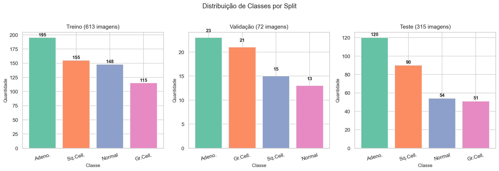
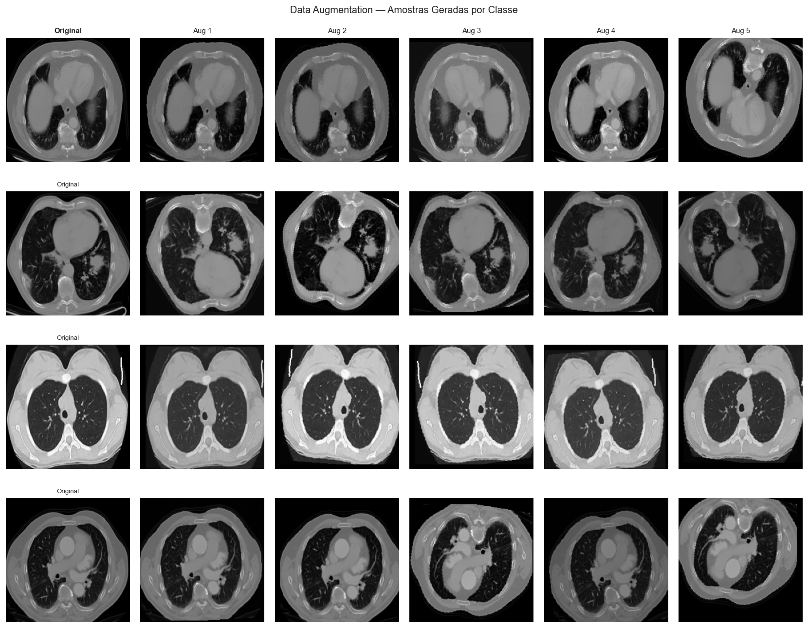
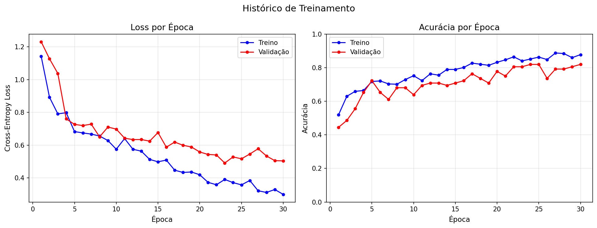
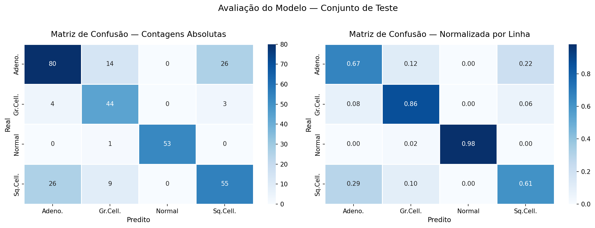
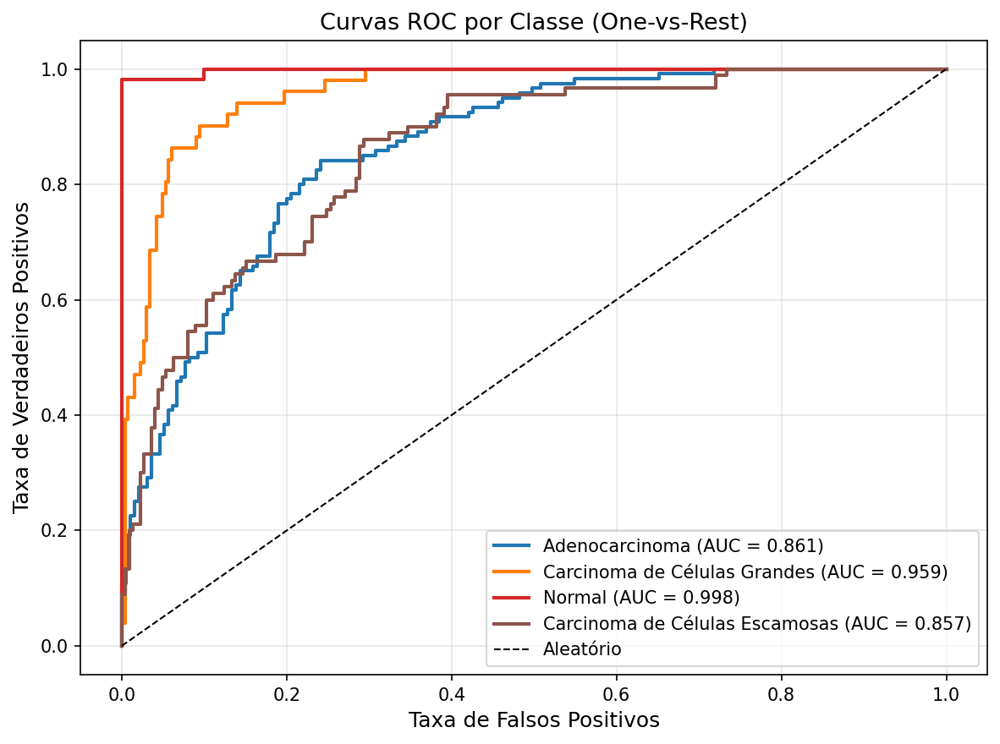

# Classificação de Câncer Pulmonar por Tomografia — Deep Learning com PyTorch

Projeto de aprendizado profundo para classificação automática de imagens de tomografia computadorizada (TC) do tórax em 4 categorias clínicas, utilizando Transfer Learning com ResNet50.

---

## Stacks Utilizadas


---

## Por que este projeto importa?

O câncer de pulmão é a **principal causa de morte por câncer no mundo**, responsável por mais de 1,8 milhão de óbitos anuais segundo a OMS. O diagnóstico precoce é o fator mais determinante para a sobrevivência — pacientes detectados no estágio inicial têm taxa de sobrevivência em 5 anos de até **56%**, contra apenas **5%** nos casos avançados.

A tomografia computadorizada é o exame padrão-ouro para triagem, mas a interpretação manual por radiologistas é:

- **Demorada** — cada TC contém centenas de cortes a serem analisados
- **Escassa** — falta de especialistas, especialmente em regiões remotas
- **Sujeita a variação** — fadiga e subjetividade impactam o diagnóstico

Este projeto demonstra que modelos de deep learning podem **classificar automaticamente** subtipos de câncer pulmonar em imagens de TC com alta confiança (AUC-ROC de **0.919**), abrindo caminho para ferramentas de suporte à decisão clínica que tornam o diagnóstico mais rápido, acessível e consistente.

---

## Resultados

| Métrica | Valor |
|---------|-------|
| Acurácia no teste | **73.65%** |
| AUC-ROC macro | **0.919** |
| Amostras de teste | 315 |
| Acurácia de treino | 87.77% |
| Acurácia de validação | 81.94% |

---

## Visualizações do Projeto

### Distribuição de Classes



O dataset apresenta **desbalanceamento de classes**: adenocarcinoma é a classe dominante (195 amostras de treino) enquanto carcinoma de grandes células é a minoria (115). Esse desequilíbrio foi tratado com `CrossEntropyLoss` ponderado por frequência inversa.

---

### Exemplos de Data Augmentation



Para aumentar artificialmente a diversidade do dataset pequeno (613 amostras de treino), foram aplicadas augmentações específicas para imagens médicas: rotações leves, flips horizontais, variação de brilho/contraste e normalização ImageNet. Augmentações agressivas (distorções geométricas severas) foram evitadas para não comprometer características clínicas relevantes.

---

### Histórico de Treinamento



O modelo foi treinado em **2 fases**: na Fase 1 apenas a cabeça classificadora foi treinada (backbone congelado), e na Fase 2 as últimas 30 camadas do ResNet50 foram descongeladas para fine-tuning com taxa de aprendizado menor. O Early Stopping com paciência de 7 épocas evitou overfitting.

---

### Matriz de Confusão



A matriz revela que o modelo performa melhor em **adenocarcinoma** e tem mais dificuldade com **carcinoma de grandes células**, a classe com menos amostras. A confusão entre subtipos histológicos é esperada mesmo em contextos clínicos reais, onde a biópsia é necessária para confirmação definitiva.

---

### Curvas ROC por Classe



As curvas ROC demonstram **excelente capacidade discriminativa** do modelo com AUC-ROC macro de 0.919. Todas as classes atingem AUC acima de 0.87, indicando que o modelo aprendeu características discriminativas relevantes para cada subtipo.

---

## Sobre o Dataset

| Split | Adenocarcinoma | Carcinoma G. Células | Normal | Carcinoma Escamoso | Total |
|-------|:--------------:|:--------------------:|:------:|:------------------:|:-----:|
| Treino | 195 | 115 | 148 | 155 | **613** |
| Validação | 23 | 21 | 13 | 15 | **72** |
| Teste | 120 | 51 | 54 | 90 | **315** |

---

## Desafios do Projeto

### 1. Dataset pequeno para deep learning
Com apenas 613 imagens de treino, treinar uma CNN do zero seria inviável. A solução foi **Transfer Learning** com ResNet50 pré-treinada no ImageNet — o modelo já parte com conhecimento de features visuais gerais e apenas adapta as camadas finais ao domínio médico.

### 2. Desbalanceamento de classes
A diferença entre a maior classe (195 amostras) e a menor (115) causa viés de predição. Foi implementado **`CrossEntropyLoss` com pesos inversamente proporcionais à frequência** de cada classe, penalizando mais os erros nas classes raras.

### 3. Overfitting com imagens médicas
Imagens de TC têm características muito específicas. Para generalizar bem com poucos dados, foi necessário calibrar cuidadosamente as augmentações — fortes o suficiente para regularizar, mas sem distorcer informações clínicas relevantes (como textura nodular e padrões de densidade).

### 4. Estratégia de fine-tuning em 2 fases
Descongelar todo o backbone de uma vez com uma taxa de aprendizado alta destruiria os pesos pré-treinados. A solução foi: **Fase 1** treina apenas a cabeça com `LR=1e-3` → **Fase 2** descongela as últimas 30 camadas com `LR=1e-4`, preservando as features de baixo nível aprendidas no ImageNet.

### 5. Compatibilidade de ambiente no macOS
O Python 3.14+ removeu APIs internas usadas pelo PyTorch. Foi necessário usar especificamente **Python 3.11** com `venv` isolado. Adicionalmente, o macOS bloqueia certificados SSL por padrão, exigindo configuração manual para o download dos pesos pré-treinados.

---

## Arquitetura

- **Backbone:** ResNet50 pré-treinada no ImageNet (Transfer Learning)
- **Cabeça:** `BatchNorm → Dropout → Linear(2048→256) → ReLU → Linear(256→4)`
- **Estratégia de treino:**
  - Fase 1: backbone congelado, treina apenas a cabeça (10 épocas, LR=1e-3)
  - Fase 2: fine-tuning das últimas 30 camadas (até 30 épocas, LR=1e-4)
- **Loss:** CrossEntropyLoss com pesos por classe
- **Otimizador:** Adam com weight decay L2
- **Scheduler:** ReduceLROnPlateau
- **Early Stopping:** paciência de 7 épocas

---

## Estrutura do Projeto

```
chest/
├── notebooks/
│   ├── 01_exploracao_dados.ipynb     # EDA e análise visual
│   ├── 02_preprocessamento.ipynb    # Validação do pipeline
│   ├── 03_treinamento.ipynb         # Treinamento (2 fases)
│   └── 04_avaliacao.ipynb           # Métricas e análise de erros
│
├── src/
│   ├── config.py       # Configurações centrais (caminhos, hiperparâmetros)
│   ├── dataset.py      # Dataset PyTorch + DataLoaders
│   ├── modelo.py       # Arquitetura com Transfer Learning
│   ├── treinamento.py  # Loop de treino + Early Stopping
│   └── avaliacao.py    # Métricas, matriz de confusão, curvas ROC
│
├── modelos_salvos/     # Checkpoints (.pth)
├── logs/               # Logs do TensorBoard
├── reports/
│   ├── eda/            # Análise exploratória
│   ├── training/       # Histórico e augmentações
│   └── evaluation/     # Métricas e predições
├── requirements.txt
└── README.md
```

---

## Configuração do Ambiente

```bash
# 1. Clone o repositório
git clone https://github.com/Filip3Owl/lung-ct-deep-learning.git
cd lung-ct-deep-learning

# 2. Crie e ative o ambiente virtual com Python 3.11
python3.11 -m venv venv
source venv/bin/activate        # macOS/Linux
# venv\Scripts\activate.bat     # Windows

# 3. Instale as dependências
pip install -r requirements.txt

# 4. Inicie o Jupyter
jupyter notebook notebooks/
```

---

## Fluxo dos Notebooks

| # | Notebook | O que faz |
|---|----------|-----------|
| 1 | `01_exploracao_dados.ipynb` | Análise exploratória: distribuição de classes, amostras visuais, dimensões |
| 2 | `02_preprocessamento.ipynb` | Verifica integridade, valida augmentações, calcula pesos de classe |
| 3 | `03_treinamento.ipynb` | Treina o modelo em 2 fases com Early Stopping |
| 4 | `04_avaliacao.ipynb` | Avalia no teste: acurácia, AUC-ROC, matriz de confusão, análise de erros |

---

## Dependências Principais

| Pacote | Versão | Uso |
|--------|--------|-----|
| PyTorch | 2.2.x | Framework de deep learning |
| torchvision | 0.17.x | Modelos pré-treinados e transforms |
| scikit-learn | 1.5.x | Métricas de classificação |
| Pillow | — | Leitura e processamento de imagens |
| albumentations | 1.4.x | Augmentações avançadas |
| matplotlib / seaborn | — | Visualizações |
| jupyter | — | Execução dos notebooks |
| tqdm | — | Barras de progresso |
| tensorboard | — | Monitoramento do treinamento |
